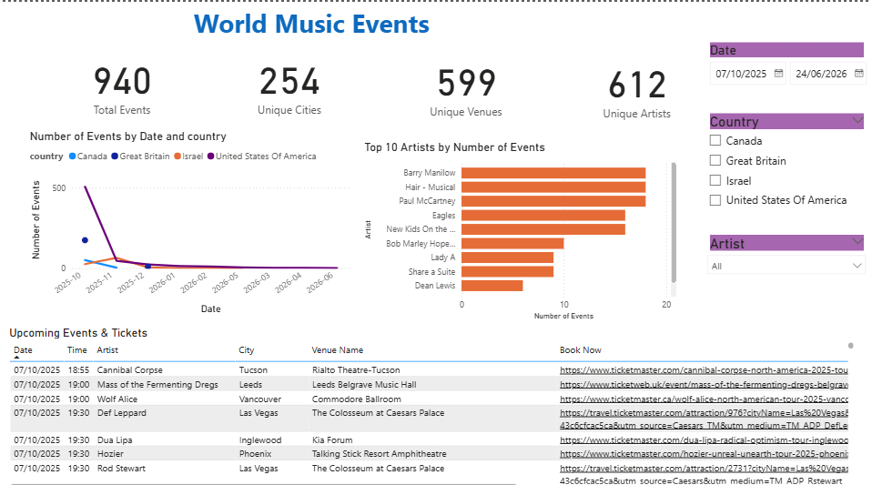

# Music Events (Power BI + Python)

This project combines **Python data collection** and **Power BI visualization**  
to explore live music events around the world using the **Ticketmaster API**.

It provides insights into upcoming concerts, top-performing artists and event distribution across countries, all within a fully interactive dashboard.

---

## Project Overview

The dataset covers **nine months of upcoming events (Oct 2025 – Jun 2026)** across  
**Israel, the United States, Great Britain and Canada**.

The dashboard includes:

- **KPIs:** Total Events, Unique Cities, Venues, and Artists  
- **Line Chart:** Event Trends by Date and Country  
- **Bar Chart:** Top 10 Artists by Number of Events  
- **Data Table:** Upcoming Events with Direct Booking Links  

---

## Technologies Used
- **Python** - Data extraction and cleaning via Ticketmaster API  
- **Pandas** - Data manipulation and transformation  
- **Power BI** - Interactive data visualization and analysis   

---

## How It Works
1. Run the Python script: `world_music_events.py`  
2. The script connects to the Ticketmaster API and collects live concert data  
3. The data is cleaned, structured, and saved as `world_music_events.csv`  
4. Load the CSV into Power BI to explore global music trends interactively  

---

## Dashboard Preview

